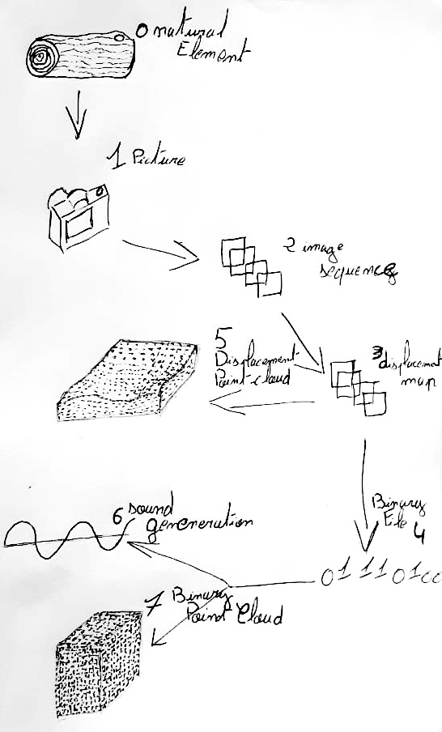

# One Ideas 


## French version 

L'idée de ce programe est de s'appuyers sur le concept de o-machine et de a-machine, en partant du proncipe que l'a-machine est presente dans tout les aspect de notre vie.  
  
  
"""  

Le chapiter commence par expliquer que nos culture nous disent comment penser et comment fonctionner. et que ce probleme est agraver par la technologie qui nous fait voir le monde d'une certaine maniere et qu'il est trés difficile de changer de point de vue une fois que l'on à deja une vision trés precise des choses (du monde).

Le probleme est vraiment aigue si l'ont parle d'ordinateur, car il faconne notre compréhession du monde bien plus que peuve le faires les marteau. Nous utilisont les ordinateurs sans vraiment en comprendre se qu'elle font (à ne pas confondre avec le comment elle fonctionne), et nous nous acceptont entierement le momde qu'elle représente... acause de selma elle en vienne à definir notre réaliter et nous font oublier l'existence d'autres réamlité. Les machines le fond meme par rapport à elles meme, quand je tape ces lignes sur ma machine elle est trés spécifique et en meme temps trés universel, c'est le meme type d'ordinateur que vous avez chez vous opu dans votre poche, et c'est aussi le meme type d'ordinareur qui gérent la bourse, la meteo, pilote les avion, cartographie le genome humain, font des recherche sur le web et mette en marche ou eteigne les feux de circulation. Toute ces machine sont les meme, les meme types d'architecture, de processeur, de memoire et parle toute le meme language ...

Aujourd'hui nous connaissons seulement ce type d'ordinateur mais ces machines que l'on utilise partout aujourd'hui sont le resultat de d'une chaine de décision dont certaine remonte à mille ans, toutes ces decision ont faconnée "l'ordinateur" sous ce nom que l'on connais aujourd'hui. Tout ces idées, invention et concepte on abouti à un resultat uniforme dans la miniére dont nous concevont les ordinateur aujourd'hui, et donc a une uniformité de pensser lorsqu'e nous les utilisons pour penser. Pour changer notre vision du monde et la facon dont nous utilisont nos ordinateur aujourd'hui, nous devriont repenser la forme meme des ordinateurs, en faisant cela nous pourriont avoir de nouvelles idées et de nouvelles facont d'aller j'usqu'au monde plus qu'humain.

""""  
Mes notes about Non Binary Machine of the books Ways of Being
  
  
  
En partant de cette idée je decide de  crée un processus de traitement de donnée qui en déclinera des formes différenrtes a partir de données similaire, ces données proviendront d'une a-machine en temps réel ce qui nous donne un jeu de données en constante evolution et un relustat de declination de forme qu "vie". 
Dans cette installation c'est l'o-machine que fait que l'ont a de vraie resultat en constante evolution, l'a-mache n'est la que pour transformer cette evolution constante en "données" comprehenssible pour les transformer en des chose plus tangible.




L'idée est que chaque point soit generer en fonction du fichier binaire :

process photo --> fichier binaire --> son --> point cloud binary --> point cloud displacement map 

Le nuage de point binaire t le nuage de point displacement map n'auros pas la meme construction car car a chaque son generer c'est une données binaire qui est traité donc le nuage de point binary avancera en meme temps que le son mais le nuage de point displacement n'auras pas la meme temporalité car il traite les pixels.   
  
  
 ``` 
  📸 Capture de l'image
    ├── (caméra, scanner, etc.)
    │
    v
🎨 Pixels bruts
    ├── (R, G, B valeurs par pixel)
    │
    v
⚪ Conversion en niveaux de gris (facultatif)
    ├── (Y = 0.3*R + 0.59*G + 0.11*B)
    │
    v
🔧 Quantification des niveaux de gris/couleurs
    ├── (256 niveaux, etc.)
    │
    v
🧩 Matrice de valeurs
    ├── (grayscale ou couleur)
    │
    v
💾 Compression (facultatif)
    ├── (ex: JPEG, PNG)
    │
    v
🔢 Encodage en binaire
    ├── (bits par pixel, par composante)
    │
    v
📁 Fichier binaire final
    ├── (les 0 et les 1)
    │
    v
💻 Ouverture avec votre logiciel préféré
 📸 Capture de l'image
    ├── (caméra, scanner, etc.)
    │
    v
🎨 Pixels bruts
    ├── (R, G, B valeurs par pixel)
    │
    v
⚪ Conversion en niveaux de gris (facultatif)
    ├── (Y = 0.3*R + 0.59*G + 0.11*B)
    │
    v
🔧 Quantification des niveaux de gris/couleurs
    ├── (256 niveaux, etc.)
    │
    v
🧩 Matrice de valeurs
    ├── (grayscale ou couleur)
    │
    v
💾 Compression (facultatif)
    ├── (ex: JPEG, PNG)
    │
    v
🔢 Encodage en binaire
    ├── (bits par pixel, par composante)
    │
    v
📁 Fichier binaire final
    ├── (les 0 et les 1)
  
```
  
Ma question a propot de tout cela aujourd'hui est, est-il poissible d'inverser ce processus ? 


## English version 


The idea of this programme is to build on the concept of o-machine and a-machine, starting from the premise that the a-machine is present in every aspect of our lives.  
  
  
  
"""

The chapter begins by explaining that our culture tells us how to think and how to function, and that this problem is exacerbated by technology, which makes us see the world in a certain way, and that it is very difficult to change our point of view once we already have a very precise vision of things (of the world).

The problem is really acute if we're talking about computers, because they shape our understanding of the world far more than hammers can. We use computers without really understanding what they do (not to be confused with how they work), and we fully accept the world they represent... because of selma they come to define our reality and make us forget the existence of other realities. It's the same type of computer that you have at home or in your pocket, and it's also the same type of computer that manages the stock market, the weather, flies planes, maps the human genome, searches the web and turns traffic lights on and off. All these machines have the same architecture, the same processor, the same memory and all speak the same language...

Today we only know this type of computer but these machines that we use everywhere today are the result of a chain of decisions some of which go back a thousand years, all these decisions have shaped "the computer" under the name that we know today. All these ideas, inventions and designs have led to a uniform result in the way we design computers today, and therefore to a uniformity of thought when we use them to think. To change our view of the world and the way we use our computers today, we'll need to rethink the shape of computers themselves, and in doing so we may have new ideas and new ways of reaching out to the more-than-human world.

""""  
My notes about Non Binary Machine of the books Ways of Being  
  
  
  
Starting from this idea I decided to create a process of data treatment which will decline different forms from similar data, these data will come from a machine in real time which gives us a set of data in constant evolution and a state of declination of form that "life". In this installation it's the o-machine that gives us real results in constant evolution, the a-mache is only there to transform this constant evolution into comprehensible "data" to transform them into more tangible things.


My question in the light of all this today is, is it possible to reverse this process?

