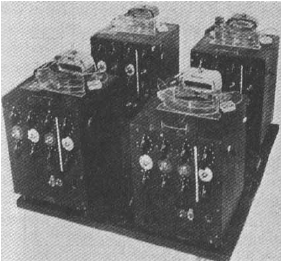

# Note about chapter "Non binary Machine" of the books --> Ways of Being 

## My notes 

**fr**:

**Phrase sortie du texte** :

- "Les idées sur la maniere dont nous devrion penser sont encrées dans notre culture. Ce probléme est exarcerber par la technologie. Une fois qu'une facon de voitr le monde est à été transformer en outils, il est trés difficile de penser autrement : `Quand on à qu'un marteau, tout ressemble à un clou` dit le proverbe."

- "Le probléme est bien plus aigu quand losqu'il s'agit de d'ardinateurs, qui faconne notre sens et notre compréhession du monde bien plus que ne le font les marteau. Nous utilison nos machines sans souvent comprendre ce qu'elle font, et nous accepton sans critique le monde qu'elle nous représentes. Elles en vienne à definir notre notre réaliter et nous faire oublier l'existence d'autre realités. Les ordinateur le font meme par rapport a eux memes. La machine dans lasquelle je tape ces mot est un ordinateur trés spécifique, mais aussi quasi universel. C'est le meme type d'ordinateur que vous avez chez vous, à votre bureau ou dans votre poche. C'est le meme type d'ordinateur, essentiellement, que ceux qui gérent la bourse , prévoie la meteo, pilote les avions, cartographie le genome humain, effectue des recherches sur le webet allume et eteigne les feux de circulation. Toute ces machines partage la meme architecture de base, la meme diposition de processeur et de lma memoire, et parle le meme language de base : Les un et les zero du code binaires."

- "Mais ce n'est pas le seul type d'ordinateur que nous pouvont imaginer ou construire. Cet ordinateur est le resultat d'une chaine trés spécifisue de découverte et de decision - dont certaine reomte à prés de mille ans - qui ont faconnée le fonctionnement de la quasi totalité des ordinateurs existants. Cette acumulation d'idée à aboutie à une formidable uniformité dont la maniere dont nous concevons les ordinateur aujourd'hui - et donc à une uniformité de penser lorsque nous les utilison pour penser. Pour changer notre facon de pencer nous et la facon dont les ordinateur fonctionnes dans nos vie, nous pourrions bien avoir besoin de repenser la forme meme des ordinateur. Ce faisont nous pourrions decouvrir de nouvelles idées et de nouvelles facons d'atteidre le monde plus qu'humain ."

- "Euresemment, il existe de nombreuse autre facon de d'envisager les ordinateurs - de nombreuse branche de l'histoire et leurs conception qui ont été abandoner, ou qui n'on jamais été complétrement explorer, dans la course éfréner vers le seul veritable avenir. L'une des branche les plus intéressante et celle qui a vue le jour a la veille de la seconde guerre mondiale, au moment meme ou l'ordinateur moderne à été concue."

- "La machine de Turing etait une experience de pensée, mais parce qu'elle est devenue la base de toute les formes future de calcul, elle à egalement modifié notre facon de penser."

- "Bien que les machines suivante aient évoler de toute sorte de facon, ce processus de lecture et de stockage, de calcul et de réecréture est toujopur a la base de leur fonctionnement. Presque tout les ordinateur du monde ne sont qu'une version plus élaborer d'une bande de papier et d'une tete de lecture/ecriture. Chaque fois que vous ouvré un mail, que vous taper sur un clavier, que vous retirer de l'argent dans un distributeur, que vous écouter une chanson numérique, que vous regarder un filml en streaming ou que vous voyer a travers d'un sattellite, vous travailler avec une incarnation d'une machine de Turing : des symboles lu et écrit à partir d'une bande de papier. J'écrit ces lignes sur une machione de Turing, il y de forte chance que vous lisier ces lignes sur une machine de turing (et si ce n'est pas le cas, de nombreuse machines ont été necéssaire pour produire ce que vous avez dans vos main)."

- "Ces ordinateur imaginer par turing sont responsable, d'une maniere ou d'une autre, de presque tout les aspet de notre vie. Mais leur omniprésence méme, masque une prise de conscience puissante : presque tout les ordinateurs qui fonctionne aujourd'hui ne représente qu'une infime partie de ce que les ordinateurs pourrait etre. Dans sont article de 1936, Turing qualifie sa machine de `a-machine`, ce qui signifie `machine automatique`. Il fait cette distinction parce qu'il voulais souligner qu'une fois mise en marche, la production de la machine était entierement determiner par sa configuration d'origine. La machine faisait se qu'on lui demmandait et était entierement limité dans ces opération par les données qu'elle contenait. Turing à noté qu'un autre type de machine était possible - une machine a choix ou une machine c - mais que la machine a était tout ce qui etait necessaire pour le type de calculs qu'il cherchaient."

- "Quelques années plus tard, dans sa thèse de doctorat, Turing mentionne à nouveau la machine à choix, sous un autre nom : cette fois, il l'appelle machine à oracle.3 Contrairement à la machine a, qui suit ses instructions sans relâche jusqu'à ce qu'elles soient terminées, cette machine o s'arrête à des moments critiques de son calcul pour "attendre la décision" de ce qu'il appelle "l'oracle"."

- "Turing a refusé de décrire cette entité plus en détail, se contentant de dire que "cela ne peut pas être une machine". Que pouvait-il bien vouloir dire ? Turing avait une idée très claire de ce que seraient les ordinateurs et de ce qu'ils pourraient faire. Les ordinateurs électroniques", écrivait-il, "sont destinés à exécuter n'importe quel processus défini par la règle du pouce qui aurait pu être réalisé par un opérateur humain travaillant de manière disciplinée mais inintelligente".4 En d'autres termes, les a-machines de Turing, les ordinateurs dont nous hériterions tous, feraient ce qu'ils font. Les limites de ces ordinateurs seront les limites de la pensée humaine. Les limites de ces ordinateurs seront les limites de la pensée humaine. En fait, elles en viendraient à la définir."

- "En particulier, ils ont façonné notre idée de la vérité et de la connaissance comme étant ce qui est calculable. Seul ce qui est calculable est connaissable, et notre capacité à penser avec des machines au-delà de notre propre expérience, à imaginer d'autres façons d'être avec elles et à leurs côtés, est donc désespérément limitée. Cette foi fondamentaliste dans la calculabilité est à la fois violente et destructrice : elle enferme dans de petites boîtes ce qu'elle peut et efface ce qu'elle ne peut pas. En économie, elle n'attribue de valeur qu'à ce qu'elle peut compter ; en sciences sociales, elle ne reconnaît que ce qu'elle peut cartographier et représenter ; en psychologie, elle ne donne de sens qu'à notre propre expérience et nie celle d'autres personnes inconnaissables et incalculables. Elle brutalise le monde, tout en nous aveuglant sur ce que nous ne réalisons même pas que nous ne savons pas."

- "Pourtant, dès la naissance de l'informatique, un tout autre type de pensée a été envisagé, et immédiatement écarté : une pensée dans laquelle un autre inconnu est toujours présent, attendant d'être consulté, en dehors des limites du système établi. La machine o de Turing, l'oracle, est précisément ce qui nous permet de voir ce que nous ne savons pas, de reconnaître notre propre ignorance, comme l'a fait Socrate à Delphes. Turing s'est concentré sur la machine a parce qu'il s'intéressait à un aspect du problème : celui de la décidabilité. Il s'agissait d'une question posée par le mathématicien allemand David Hilbert dans son ouvrage influent intitulé Entscheidungsproblem de 1928, qui demandait s'il était possible de construire un processus algorithmique étape par étape pour résoudre ce que l'on appelle les "problèmes de décision". À partir d'une question oui/non, est-il possible d'écrire un ensemble d'instructions garantissant une réponse oui/non ? Turing a conclu que non, mais ce faisant, il a créé un nouveau cadre pour la résolution des problèmes de décision."

- "Mais ce qui m'intéresse, c'est l'indécidabilité. L'indécidabilité a également un sens technique, mais elle a aussi un sens réel, un sens littéral, qui fait référence à ce que nous ne pouvons pas savoir avec certitude. Soucieux de savoir comment penser et comprendre la vie d'êtres radicalement différents des nôtres, et comment nous repenser nous-mêmes dans ce processus, nous pourrions considérer l'indécidabilité non pas comme un obstacle à la compréhension, mais comme un signe, un indice, un parfum de truffe, indiquant que quelque chose d'intéressant, voire d'utile, est à portée de main."

- "L'un des plus grands malentendus du vingtième siècle, qui persiste encore aujourd'hui, était que tout n'était en fin de compte qu'un problème de décision. L'apparition des ordinateurs a été si merveilleuse et leurs capacités si puissantes qu'elle nous a convaincus que l'univers est comme un ordinateur, que le cerveau est comme un ordinateur, que nous, les plantes, les animaux et les insectes sommes comme des ordinateurs - et le plus souvent, nous oublions le "comme". Nous considérons le monde comme une chose à calculer, et donc susceptible d'être calculée. Nous le considérons comme quelque chose qui peut être décomposé en points discrets de données et alimenté par des machines. Nous pensons que la machine nous donnera des réponses concrètes sur le monde, sur lesquelles nous pourrons agir, et confère à ces réponses une irréfutabilité logique et une impunité morale."

- "Le monde n'est pas comme un ordinateur. Les ordinateurs - comme nous, comme les plantes et les animaux, comme les nuages et les mers - sont comme le monde. Certains plus que d'autres, certains mieux adaptés à ses processus - et beaucoup moins. L'intelligence artificielle des entreprises, la stupidité artificielle et toutes les autres formes débiles que nous avons créées au fil des ans - les bases de données qui trient et échouent, les marchés boursiers qui s'effondrent et s'appauvrissent, les algorithmes qui surveillent et jugent - ont ceci en commun. Ce sont des machines à décider : elles tentent de dominer le monde en en faisant des modèles et en prenant des décisions basées sur ce modèle. Faire un modèle, c'est abstraire et représenter : c'est un acte de distanciation par rapport au monde. Mais le monde est déjà là, il est devant nous. Nous y sommes suspendus et nous en sommes imprégnés : nous en sommes inséparables."

- "Les machines dont nous avons besoin pour donner un sens à ce monde omniprésent, efflorescent et enchevêtré - où donner un sens est analogue, comme l'a dit Wittgenstein à propos du langage, à participer à un jeu - ne devraient pas être plus éloignées, plus abstraites, mais plus proches du monde."

- "Parmi les premières et les plus adorables de ces machines figurent les petits robots construits par le neurophysiologiste William Grey Walter à l'Institut neurologique Burden de Bristol à la fin des années 1940. Ces robots étaient de petits automates à roues, dotés d'une carapace dure, qui se déplaçaient et se cognaient dans la pièce et qui, grâce à l'ingéniosité de Walter, modifiaient leur comportement en fonction de leur âge."

- "Il les a appelés Machina speculatrix, désignant une nouvelle espèce de machine, mais elles sont plus connues sous le nom de tortues. Des capteurs situés sous leur carapace enregistrent les chocs avec des objets et les font repartir dans une autre direction. De cette manière, elles se déplaçaient de manière aléatoire et trouvaient le moyen de contourner divers obstacles. Le premier couple de tortues, que Walter a appelé Elmer et Elsie, était également équipé de capteurs de lumière. Cela leur conférait une capacité observée chez de nombreux animaux, appelée phototaxie, c'est-à-dire une attirance vers la lumière. Comme les papillons de nuit et les méduses, les tortues se déplacent vers la source de lumière la plus proche et la plus puissante, ce qui leur permet d'être guidées dans la pièce à l'aide d'une torche ou de retourner dans leur "niche" bien éclairée pour se recharger lorsque leur batterie est déchargée."

- "Walter a comparé les deux capteurs - lumière et mouvement - à deux neurones, constituant un minuscule cerveau. Pourtant, les interactions dynamiques entre ces deux neurones de base étaient suffisantes pour produire une série de comportements complexes, ou ce que Walter a décrit comme `l'incertitude, le hasard, le libre arbitre ou l'indépendance qui sont si manifestement absents de la plupart des machines bien conçues`"

- "Par exemple, les capteurs de lumière primitifs de la tortue étaient facilement surchargés, ce qui signifie que les lumières les plus vives la repoussaient. Elles commençaient donc par se diriger vers une source lumineuse, puis reculaient lorsqu'elles s'en approchaient de trop près, puis avançaient à nouveau, et ainsi de suite. Ils tournaient ainsi autour des lampes dans un schéma nerveux et bégayant d'approche et de recul."

- "La capacité la plus frappante des tortues a été produite de manière tout à fait inattendue par l'ajout d'un petit écran lumineux sur leur dos, destiné à indiquer que leur moteur était en marche. Immédiatement, les machines ont affiché un nouveau comportement : à l'approche d'un miroir ou d'une autre surface réfléchissante, elles apercevaient leur propre lumière et commençaient immédiatement à se secouer devant leur propre reflet `d'une manière si spécifique`, écrit Walter, `que si c'était un animal, un biologiste serait justifié de lui attribuer une capacité d'autodiscipline`."

- "Vingt ans avant sa définition officielle, les tortues ont passé le test du miroir. Walter opposait ses tortues aux premiers ordinateurs, qui, ne connaissant qu'un langage de uns et de zéros et dépourvus de sens au-delà de l'entrée directe de données, étaient, selon lui, "en aucun cas libres comme le sont la plupart des animaux;"

- "Cette idée, selon laquelle la technologie pourrait être capable de s'adapter à son environnement, était au cœur de la cybernétique, un domaine d'étude né après la Seconde Guerre mondiale et qui, depuis lors, a rassemblé un groupe hétéroclite de scientifiques, de chercheurs, de psychiatres, d'artistes et d'énergumènes sous son égide. Définie en 1948 comme "l'étude scientifique du contrôle et de la communication chez l'animal et dans la machine", la cybernétique a par la suite traversé les disciplines, influençant les études sur l'apprentissage, la cognition, l'auto-organisation, la rétroaction biologique, la robotique et la gestion d'entreprise, sans jamais se fondre dans un discours fixe ou s'installer confortablement dans un milieu universitaire unique département."

- "Cet appareil avait été conçu quelques années plus tôt par un autre psychiatre anglais, W. Ross Ashby, qui a souvent décrit sa création comme un cerveau artificiel. En fait, l'homéostat consistait en un ensemble de quatre unités de contrôle de bombes de la Royal Air Force, câblées ensemble pour réagir aux entrées et sorties de chacune d'entre elles. Ces unités avaient été développées pendant la guerre en tant que dispositifs de rétroaction automatisés, qui réagissaient à un signal entrant en augmentant ou en diminuant un autre signal."

- "Lorsqu'il a relié quatre de ces unités entre elles, Ashby a constaté qu'elles essayaient d'ajuster leurs paramètres jusqu'à ce qu'elles atteignent une sorte de stabilité les unes par rapport aux autres - leurs entrées et leurs sorties fluctuant jusqu'à ce qu'elles parviennent à l'équilibre. En outre, lorsque l'une d'entre elles était perturbée, l'ensemble du système se réajustait jusqu'à ce que la stabilité soit rétablie. Ashby a appelé cette capacité "ultrastabilité adaptative". Quoi que fassent ses collègues pour perturber la machine - en intervertissant les connexions, en inversant les fils positifs et négatifs, en attachant ensemble les bras magnétiques oscillants ou en bloquant leur mouvement - l'ultrastabilité s'est maintenue. a toujours retrouvé un état stable."

- "C'est cette capacité à s'autocorriger et à trouver de nouveaux modèles stables qui a conduit Ashby à décrire ces unités comme des sortes de cerveaux artificiels : il les a en effet comparées à l'esprit non développé d'un chaton. Lorsqu'il est jeune, le chaton ne sait pas que la viande rouge est bonne et que le feu rouge est mauvais, mais les réactions positives et négatives le remettent rapidement dans le droit chemin, créant ainsi un modèle de comportement mémorisé."

- "Walter (Grey Walter) a été impressionné par l'homéostat, mais il l'a trouvé limité, "comme une créature endormie qui, lorsqu'elle est dérangée, s'agite et trouve une position confortable".11 Contrairement à l'homéostat, ses tortues étaient mobiles et exploratrices : elles n'attendaient pas que leur équilibre soit rompu, mais se déplaçaient à la recherche de problèmes."

- "Pour programmer une machine, il suffit de lancer dans le monde un système capable de réagir de façon nouvelle et de le laisser s'adapter. C'était le principe central de la cybernétique : s'adapter au monde était une approche plus puissante et plus appropriée que d'essayer de l'anticiper et de le contrôler."

- "L'intérêt de l'homéostat et des tortues est qu'ils s'adaptent à leur environnement au fur et à mesure qu'ils le rencontrent. Combien de fois est-ce l'objectif de nos technologies ? Nous considérons la technologie avant tout comme une solution aux problèmes auxquels nous sommes confrontés (y compris, trop souvent, ceux que nous avons créés). Mais Walter, Ashby et les autres cybernéticiens de la première heure voyaient la technologie comme quelque chose de très différent : quelque chose doté de sa propre agence et de ses propres capacités, dont les réactions étaient incertaines et dont le comportement devait refléter ses propres rencontres avec le monde."

- ""

